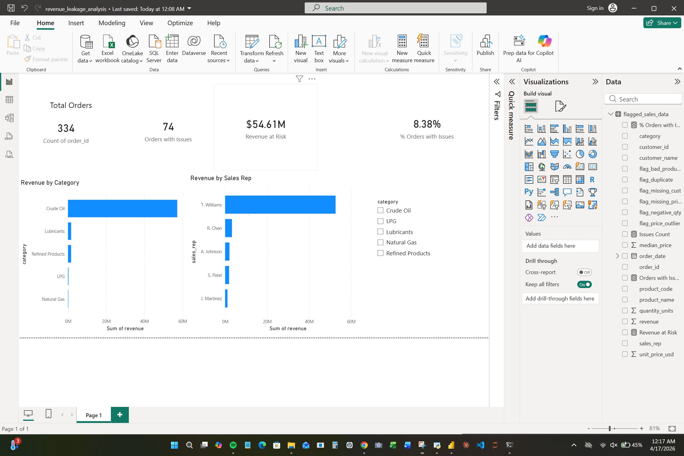

# Sales & Pricing Data Quality Audit — Revenue Leakage Analysis
**Industry:** Oil & Gas | **Tools:** Python, Pandas, Power BI, Excel

---

## What This Project Is

I took a raw sales export from an oil & gas operation — 334 orders across 8 customers and 10 products — and audited it for data quality issues. Turns out 32% of the records had problems. Duplicate orders, missing prices, negative quantities, and fat finger pricing errors that nobody caught.

The biggest one: a Crude Oil Brent order priced at $8,230 per unit instead of $82.30. That kind of error silently destroys revenue reporting.

Total revenue tied to flagged records: **$54.61M**

---

## What I Found

| Issue | Records | Revenue Impact |
|---|---|---|
| Duplicate Orders | 28 | $1,066,232 |
| Negative Quantity | 27 | $1,664,398 |
| Missing Unit Price | 21 | — |
| Price Outliers | 8 | $51,554,751 |
| Missing Customer ID | 11 | $320,751 |
| Bad Product Name | 12 | $697,733 |
| **Total** | **107 records (32%)** | **$54.61M at risk** |

Price outliers were the worst — 8 records, but they account for 94% of the revenue impact. Fat finger errors are hard to catch manually, which is exactly why you need validation rules.

---

## How I Did It

**Python (Pandas)** — loaded the raw CSV, flagged each issue type, calculated revenue at risk per category, exported clean and flagged versions of the data

**Power BI** — built a dashboard with 4 KPI cards (total orders, orders with issues, revenue at risk, % orders with issues), two bar charts broken down by category and sales rep, and a category slicer

**Excel** — used for raw data storage and the issue summary export

---

## Dashboard

---

## What I'd Fix

1. Add a price validation rule that flags anything more than 3x above or below the product median before an order gets confirmed
2. Make customer ID a required field at order entry — 11 orders had none, meaning you can't bill them
3. Build duplicate order detection into the entry system — 28 duplicates suggests a process gap, not just human error
4. T. Williams had the highest revenue volume — worth a spot check on their orders first

---

## Files

| File | What it is |
|---|---|
| `raw_sales_data.csv` | The original messy data |
| `cleaning_script.py` | Python script that runs the full audit |
| `flagged_sales_data.csv` | Every record with issue flags added |
| `cleaned_sales_data.csv` | Clean records only (227 of 334) |
| `revenue_leakage_summary.csv` | Summary table of issues and revenue impact |
| `revenue_leakage_analysis.pbix` | Power BI dashboard |

---

**Riad Hasan**
BBA — Management Information Systems, University of Houston-Downtown
[LinkedIn](https://linkedin.com/in/hasanuhd) | [GitHub](https://github.com/riadhasan380-ux)
